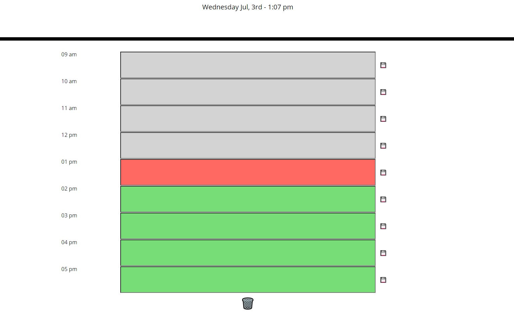

# Day Planner - Unit 5

## Description

This website was developed to be a day planner for normal working hours between 9am and 5pm. With timestamps on the left hand side each has a seperate input form that is used to store data that was input by the user to localStorage to be able to reload or come back to the page throughout the day to have access to the information. Each for also has a button to save the data on the right. Without pressing this button next to each form the information will not be saved. Throughout the day the background color is also updated using moment.js to determine the time, with grey meaning the past, green the future, and red the current hour. At the bottom of the page I added a clear button that clears localStorage to reset the form for future days easily. 

For development I began with the HTML while using bootstrap to position and add style to the elements, this was pretty simple orignally I wanted to use a table to display everything however I ran into issues when trying to format and use bootstrap, which ended up making the page look weird with different sizes of everything.  Instead each row is a different div that has an associated class of row with element inside taking up different amounts of columns thanks to bootstrap. With the basic HTML in place we used jQuery and moment.js to get the current time and date and display that at the top of the page. Also using moment again to specifiy the hour at which each time interval was at, by using the start of method and adding to get to the current time. This is used then to compare the current time at the start of the hour to the each time variable, which is then assigned a class based on if it is before, after, or during the current time. The buttons on the side all have the same class to not repeat to much script, using the keyword this and the DOM traversale from jQuery we are about to find the siblings to save the proper form value, as well as get a data index for the time to be saved in local storage and easily pulled. This saves the data from the form into local storage as a value with the data of time as the key to be able to get it back. When pulling from local storage a for loop is used to loop through a created array with each time index number to get the proper item from local storage. Which is then used to used the val of the forms on the page to the data pulled. At the bottom of the page I added a button that clears local storage and reloads the page to be able to clear the form easily for the next day. 

An issue I came across with this project was how I wanted to store the values of the forms to localstorage, I could store then as an object within an array to push and pull the whole data set at once. However I decided and implemented instead that each form value was uploaded to the storage on an individual basis to make it easier to access specific elements and keep it more organized. I believe this was the right decision as otherwise there would need to be additional lines of code to keep everything sorted.

## Links
[Deployed-Site](https://niklasertle.github.io/nje-day-planner/)

